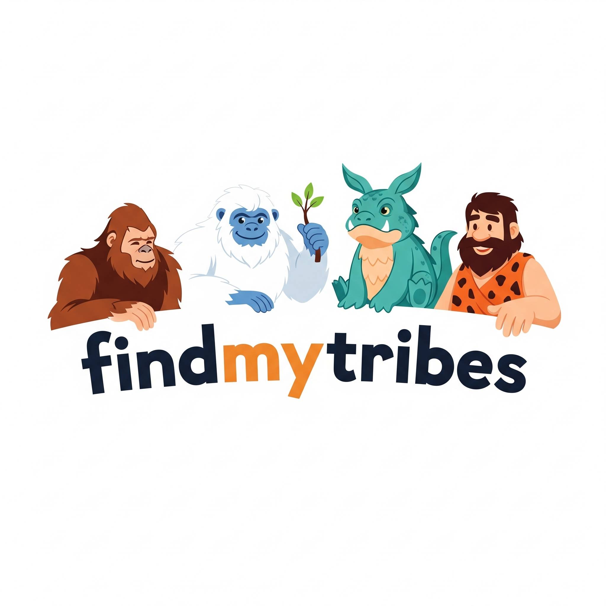

# Find My Tribe

Welcome to **Find My Tribe** – a modern, open-source platform for discovering, creating, and joining meetups, events, and tribes. This project is a full-stack, modular, scalable alternative to traditional meetup platforms, built with a .NET backend and a React (Vite) frontend.

---

## 🚀 Demo Screenshots

> See the app in action! (More in [demo/README.md](demo/README.md))

<p align="center">
  
  
  
  
  
  
</p>

---

## Project Structure

- **api/**  
  The .NET 9 Web API backend. Contains all RESTful endpoints, models, repositories, and business logic. 
  - [api/README.md](api/README.md)
- **findmytribe-frontend/**  
  The modern React frontend (Vite + TypeScript). Features a glacier/icy theme, mobile-first design, and real API integration. 
  - [findmytribe-frontend/README.md](findmytribe-frontend/README.md)
- **infrastructure/**  
  (Optional) Infrastructure, deployment, or DevOps scripts.
- **template/**  
  (Optional) Project templates or starter code.

---

## Quick Start

1. **Clone the repo:**
   ```sh
   git clone https://github.com/arpanpathak/findmytribe.git
   cd findmytribe
   ```
2. **Backend:**
   - See [api/README.md](api/README.md) for setup and API usage.
3. **Frontend:**
   - See [findmytribe-frontend/README.md](findmytribe-frontend/README.md) for running the React app.

---

## About

- **Events:** Create, browse, and manage events with robust pagination and search.
- **Tribes:** Join or create tribes, manage memberships, and discover communities.
- **Profiles:** User profiles, attendance, and more.
- **Modern UI:** Glacier-inspired, immersive, and mobile-first.
- **Developer Friendly:** Modular code, in-memory seeding, and easy to extend.

---

## Documentation

- [API Spec (outdated)](api/api-spec.md)
- [Backend README](api/README.md)
- [Frontend README](findmytribe-frontend/README.md)

> **Note:** Some documentation may be outdated. Please refer to the code and READMEs in each subfolder for the latest information.

---

## Contributing

Pull requests and issues are welcome! See the subproject READMEs for contribution guidelines.

---

## License

This project is licensed under the [MIT License](LICENSE).

---

## API Endpoints Overview

### Events API
- `GET /api/events` — List events (supports pagination)
- `GET /api/events/{id}` — Get event by ID
- `POST /api/events` — Create event
- `PUT /api/events/{id}` — Update event
- `DELETE /api/events/{id}` — Delete event

### Tribes API
- `GET /api/tribes` — List all tribes
- `GET /api/tribes/{id}` — Get tribe by ID
- `POST /api/tribes` — Create tribe (name & description required)
- `PUT /api/tribes/{id}` — Update tribe
- `DELETE /api/tribes/{id}` — Delete tribe

### Profiles API
- `GET /api/profiles` — List all profiles
- `GET /api/profiles/{id}` — Get profile by ID
- `POST /api/profiles` — Create profile
- `PUT /api/profiles/{id}` — Update profile
- `DELETE /api/profiles/{id}` — Delete profile

### Attendances API
- `GET /api/attendances/event/{eventId}/statistics` — Get event attendance stats
- `POST /api/attendances/event/{eventId}` — Set attendance for a profile

---

> For detailed request/response formats, see the code or controller XML docs. This overview is always up-to-date with the codebase.

---

Enjoy building your tribe! 🌐❄️
